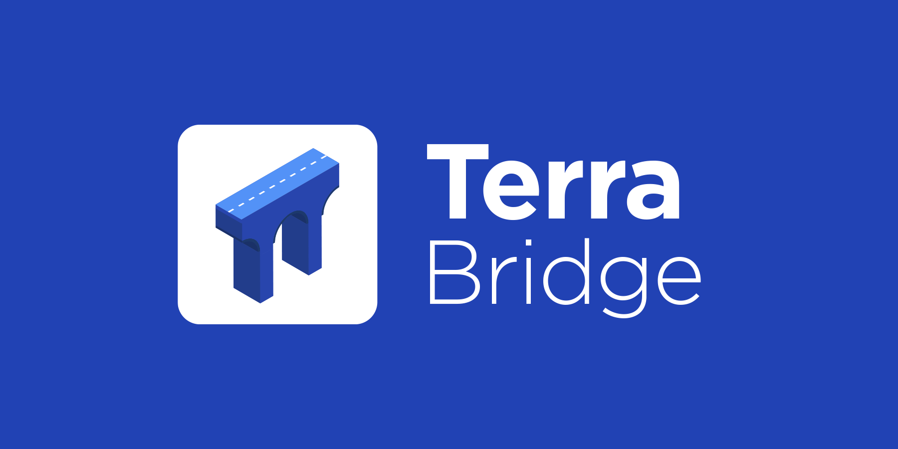

# Terra Bridge Web App



The **Terra Bridge** is a web frontend that allows users to easily send Terra assets across supported blockchains via their respective bridges.

Users can connect their wallets to the Terra Bridge web app through a browser plugin for Chromium-based web browsers, as shown below:

| Blockchain | Supported Wallets                                                                                                                                                                                                                          |
| ---------- | ------------------------------------------------------------------------------------------------------------------------------------------------------------------------------------------------------------------------------------------ |
| Terra      | [Terra Station Extension](https://terra.money/extension)                                                                                                                                                                                   |
| Ethereum   | [MetaMask](https://chrome.google.com/webstore/detail/metamask/nkbihfbeogaeaoehlefnkodbefgpgknn?hl=en), [CoinBase](https://wallet.coinbase.com/) or [Trustwallet](https://trustwallet.com/) for [WalletConnect](https://walletconnect.org/) |
| BSC        | [Binance Chain Wallet](https://chrome.google.com/webstore/detail/binance-chain-wallet/fhbohimaelbohpjbbldcngcnapndodjp?hl=en) or [MetaMask](https://chrome.google.com/webstore/detail/metamask/nkbihfbeogaeaoehlefnkodbefgpgknn?hl=en)     |

## Instructions

1. Install dependencies

```bash
$ npm install
```

2. Run Bridge

```bash
$ npm start
```

## License

This software is licensed under the Apache 2.0 license. Read more about it [here](./LICENSE).

© 2021 Terra Bridge Web App
